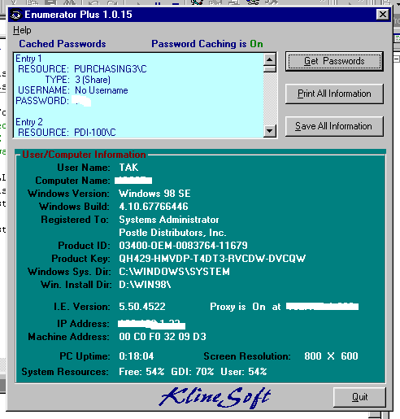



## Enumerator Plus

### Description

This is an update to my post of a week ago. It now saves to file, shows if password caching is on or off, and displays proxy on/off status and ip of proxy. Removed gradient affect for faster loading. Next version will have ability to toggle password caching on/off, change computer name, change registered owner and backup the registry. Hope you all enjoy this. Use very carefully. I cannot be responsible for any misuse of this program.
 
### More Info
 
Lots of information.

             |
---                |---
**Submitted On**   |2001-02-08 15:36:02
**By**             |[TonyK](https://github.com/Planet-Source-Code/PSCIndex/blob/master/ByAuthor/tonyk.md)
**Level**          |Intermediate
**User Rating**    |5.0 (10 globes from 2 users)
**Compatibility**  |VB 6\.0
**Category**       |[Complete Applications](https://github.com/Planet-Source-Code/PSCIndex/blob/master/ByCategory/complete-applications__1-27.md)
**World**          |[Visual Basic](https://github.com/Planet-Source-Code/PSCIndex/blob/master/ByWorld/visual-basic.md)
**Archive File**   |[CODE\_UPLOAD14696282001\.zip](https://github.com/Planet-Source-Code/tonyk-enumerator-plus__1-15124/archive/master.zip)

### API Declarations

Lots...see code.

